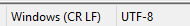

# Switching to another included language

There are several languages included in the plugin dll. The current languages are:
* English (default)
* English with emotes
* Russian
* Russian with emotes
* Polish
* Polish with emotes
* Italian
* French
* French with emotes

You can choose which language you want to use by setting the config entry `settings.language` to the name of the language file in all lower-case. You can find the language files in `SCPDiscord/Languages` in your global config directory.

# Editing or adding a new language

**Make sure the file encoding is UTF-8, other encodings like UTF-8 BOM do not work. Also, make sure the line endings match your operating system.**

In notepad++:



If you are making a new language you can copy the english.yml file and name the new file something in all lowercase. Otherwise you can just edit the english file directly. Below is a more in depth guide, but you can just edit the existing words instead if you wish.

If you want to you can submit your language file to the default languages by either making a pull request here on GitHub or by sending it to me either in an issue here or in Discord.

### Messages
These are the messages that are sent to Discord, you can add variables to them with the <var:name> syntax. If you for instance want to add an IP-address to the OnConnect event message you can put `"Player is connecting with IP address <var:ipaddress>."` which will become for instance `Player is connecting with IP address 127.0.0.1.` in Discord.

All available variables are listed as comments on each event.

### Regex
This will not be necessary for most users.

Aside from the messages themselves, the language file contains several different regex options. You can add any number of regular expression to each entry by separating them with a comma, check the `english.yml` file for examples of this.

If you are unfamiliar with regex, don't worry, you can basically think of it as replacing the left side with what is on the right. Regex does support much more advanced syntax and if it does not behave the way you expect it to you may have accidentally used it.

If you are interested in learning how regex works use this link to start learning some simple patterns: [RegExr](https://regexr.com/)

### Order of operations

As this config is basically just doing lots of replacements on the same message before sending it, the order of operation may matter to you.

It is as follows:

1. The unparsed message is read from the config.
2. All variables are added to the message except names
3. The `global_regex` replacements are executed, I use this to fix names of variables such as classes and items.
4. The message specific `regex` is executed, I use this for simple logic replacements such as
```yaml
# This replaces isopen:<var:open> with close if the door is open
# and with open if the door is closed.
message: "<var:name> (<var:steamid>) tried to isopen:<var:open> a locked door."
regex: ["isopen:True":"close", "isopen:False":"open"]
```
5. The variables representing names are added in, this is to make sure players don't use names with words that get accidentally or deliberately replaced by your above regex replacements.
6. The `final_regex` is executed and is meant mostly to perform replacements in player names if that is something you wish to do. Example here:
```yaml
# (?i) Is a regex way of making it case-insensitive.
final_regex: ["(?i)nigger":"Edgy boi"]
```